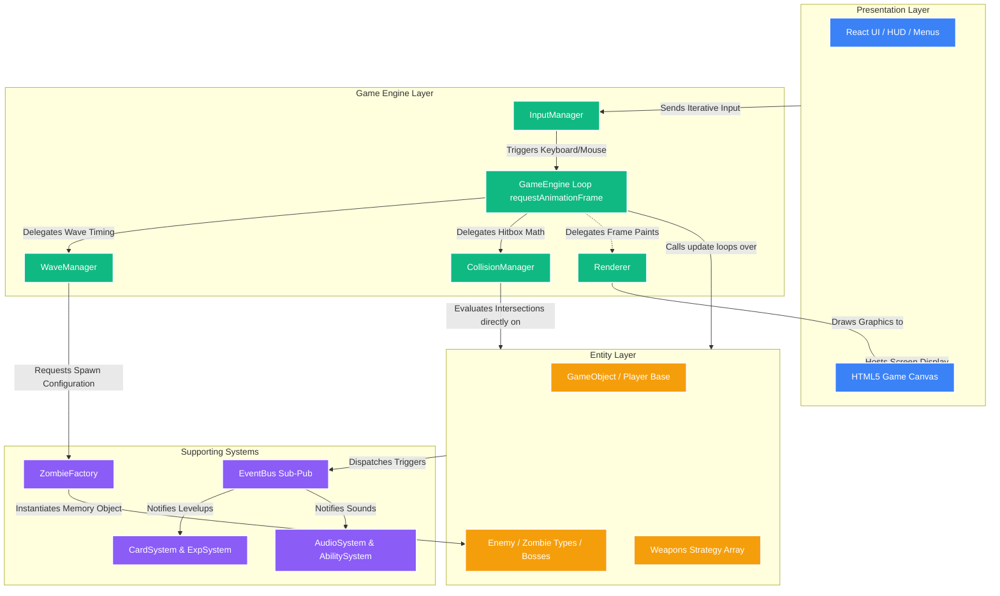

# Zombie Survival Shooter

A wave-based 2D browser survival game built with Next.js, React, and TypeScript, rendered on HTML5 Canvas. The project is structured using Object-Oriented Design and adheres to the SOLID principles.

Live: https://zombie-survival-shooter.vercel.app  
Repository: https://github.com/ubhranipreetish/Zombie-Survival-Shooter
Report: https://docs.google.com/document/d/1_PQ2Wyk3EHsNt_vwN3FSNbhy0mxrPrbi9fhJy_KdyZg/edit?usp=sharing
---

## Tech Stack

| Layer | Technology |
|---|---|
| Framework | Next.js 16 |
| UI Library | React 19 |
| Language | TypeScript 5 |
| Styling | Tailwind CSS 4 |
| Rendering | HTML5 Canvas 2D API |
| Package Manager | npm |
| Deployment | Vercel |
| Version Control | Git and GitHub |

---

## Setup and Installation

**Prerequisites:** Node.js v18 or higher, npm v9 or higher, Git.

```bash
# Clone the repository
git clone https://github.com/ubhranipreetish/Zombie-Survival-Shooter.git
cd Zombie-Survival-Shooter

# Install dependencies
npm install
```

No environment variables are required to run the project locally.

---

## How to Run

```bash
# Development server (http://localhost:3000)
npm run dev

# Production build
npm run build
npm start

# Lint and type check
npm run lint
npx tsc --noEmit
```

---

## Architecture



The project is divided into four layers:

**Presentation Layer** — React components handle all UI concerns: the game canvas, HUD, main menu, pause menu, card selection, and game over screen.

**Game Engine Layer** — A custom engine built in TypeScript manages the core game loop via `requestAnimationFrame`. Key modules include `GameEngine`, `WaveManager`, `CollisionManager`, `InputManager`, and `Renderer`.

**Entity Layer** — All game objects extend a base `GameObject` class. The `Enemy` abstract class is subclassed into six zombie types and five boss encounters. Weapons implement a shared `IWeaponStrategy` interface. New types can be added without modifying existing code.

**Supporting Systems** — Standalone modules handle audio (`AudioSystem`), experience and levelling (`ExpSystem`), card-based upgrades (`CardSystem`), and player abilities (`AbilitySystem`). An `EventBus` decouples communication between systems using a publish-subscribe pattern. A `ZombieFactory` centralises enemy creation per wave configuration.

**Design patterns used:** Strategy (weapons), Factory (enemy creation), Observer (EventBus), Singleton (GameEngine), State (game state machine), Object Pool (bullets and particles).

UML diagrams covering the class hierarchy, use cases, sequence flows, and entity relationships are available in the `diagrams/` directory.

---

## Team and Contributions

| Name | Role 
|---|---|
| Preetish Ubhrani | Project Lead and Game Architect 
| Aditya Bhardwaj | Game Systems Developer 
| Kshitiz Surana | Frontend Developer 
| Pushkar Jain | Systems Developer