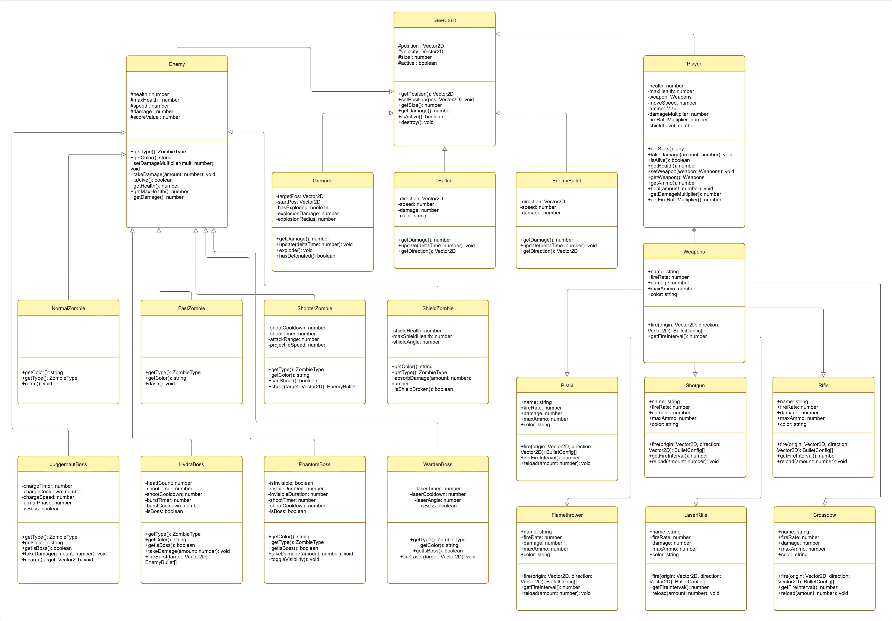
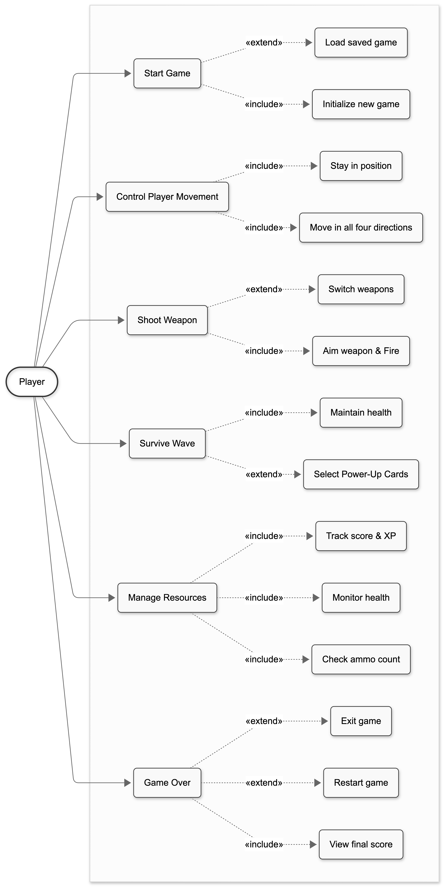
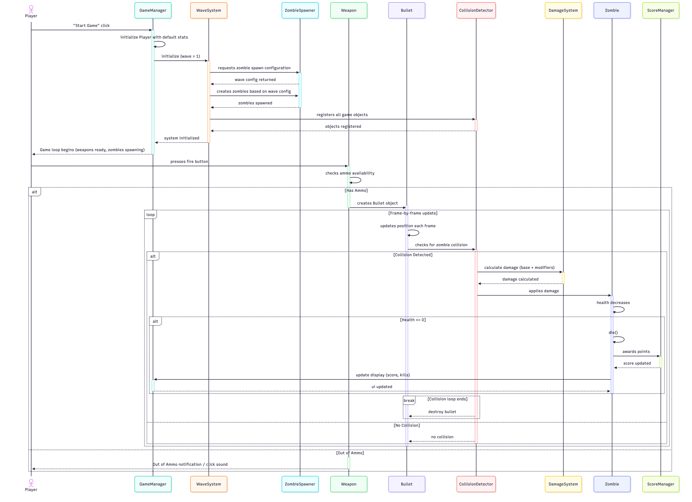

# Project Report: Zombie Survival Shooter

## 1. Problem Statement and Solution Approach
**Problem Statement:**  
The challenge was to develop an optimized, complex 2D browser based zombie survival shooter. As waves progress, entity density (zombies, bullets, projectiles) exponentially scales. A poorly structured architecture would result in massive performance degradation and unmaintainable logic. 

**Solution Approach:**  
We approached the development with a strict adherence to Object Oriented Programming (OOP) and classical System Design principles. Utilizing TypeScript allowed us to enforce strong data models (interfaces, abstract classes). The system fundamentally decouples the core mechanics (Entity representation, Physics manipulation, Rendering logic, and Wave Spawning) by routing them through dedicated Manager layers.

---

## 2. System Design Optimization
To ensure scalability and high performance across browsers, several system design limits were optimized in the codebase:
- **Time Delta Architecture:** Object velocity and physics calculations are inherently decoupled from frame rates. By using a strictly managed `deltaTime` multiplier, performance dips or high refresh rate monitors do not artificially alter the speed of the gameplay layer.
- **Centralized Sub System Orchestration:** We abstracted highly iterative operations (like O(N*M) hit detection logic) away from individual objects and localized it into a centralized `CollisionManager`. This optimizes loop logic and prevents memory leaks inside isolated entities checking boundaries concurrently against out of scope siblings.
- **Garbage Collection Optimization:** Instead of hard deleting logic constantly, array cleanups operate asynchronously batching dead entities using flag filtering (`isActive: boolean`). 

---

## 3. Object Oriented (OOP) Concepts
The architecture takes complete advantage of the four primary pillars of OOP:
- **Encapsulation:** Class internals are rigorously sealed. In the `Player` class, properties like `health`, `moveSpeed`, and `damageMultiplier` are designated `private` or `readonly`, strictly manipulatable only via authorized getter bounds and mutation methods like `applyDamage()` or `heal()`.
- **Inheritance:** An efficient inheritance tree is implemented to reduce redundancy. The system centers on a core `GameObject` logic class handling fundamental physical laws (`position`, `velocity`). The `Enemy`, `Player`, and `Bullet` structures inherit this, while expanding traits downward (e.g., `JuggernautBoss` recursively inheriting from `Enemy` representing hierarchical specialization).
- **Polymorphism:** Method overriding dictates universal update sequences. The primary `GameEngine` tracks an array of `GameObject[]` and calls `update()` safely, trusting that the underlying concrete class (whether a simple `Bullet` or a `HydraBoss`) will trigger its own polymorphic logic inherently correctly. 
- **Abstraction:** The firing algorithms are completely abstracted via the `Weapons` interface. The core game loop does not need to understand *how* a shotgun works, only *that* a trigger was pulled, abstracting algorithm complexities away from caller pipelines.

---

## 4. Design Patterns Utilized
1. **Strategy Pattern:** 
   * **Where:** The implementation of the `Weapons` array structure (`Pistol`, `Shotgun`, `LaserRifle`).
   * **Why:** This decouples the firing logic from the `Player`. Instead of maintaining massive `switch/case` pipelines inside the player model determining how many bullets should spawn, the `Player` merely utilizes `weapon.fire()`. At runtime, we can trivially swap the concrete strategy object equipped to alter the underlying behavioral algorithm entirely seamlessly.
2. **Manager Pattern:**
   * **Where:** `CollisionManager` and `WaveManager`.
   * **Why:** In massive game architectures, tight coupling causes infinite recursion boundaries. Applying the Manager pattern hides the incredibly verbose mathematical complexity of overlapping rectangles tracking logic behind a simplified module entry point natively invoked by the broader framework.

---

## 5. Application of SOLID Principles
The codebase represents a masterclass in clean architecture rules:
- **S - Single Responsibility Principle:** A class handles precisely one aspect of business logic. The `WaveManager` specifically dictates when and where zombies spawn. It does not control how they move, nor does it control collisions; these are delegated off to sibling handlers responsibly.
- **O - Open/Closed Principle:** The game is open extension but shielded from modification. We added a `Phantom Boss` and `Flamethrower` seamlessly by creating new classes extending existing interfaces (`Weapons`) without needing to modify the foundational engine iteration codeblocks.
- **L - Liskov Substitution Principle:** Instances of `Enemy` can be trivially replaced with subclass instances (`WardenBoss` or `ShooterZombie`) and passed sequentially into the renderer tracking arrays without compromising system reliability.
- **I - Interface Segregation Principle:** Interfaces in the framework remain intentionally thin. The `Weapons` structure focuses exclusively on `<fire>` routines, preventing unused logic chains from bottlenecking implementing components.
- **D - Dependency Inversion:** High level entities (`Player`) depend exclusively on pure abstractions (the `Weapons` Interface) rather than concrete lower level artifacts (importing instances of `Crossbow`).

---

## 6. Comprehensive Test Cases and Results
While UI browser elements require extensive manual matrix testing, core integration tests run as follows:

| Test ID | Test Scenario | Logic Validated | Expected Result | Result Status |
|---|---|---|---|---|
| **T-001** | `Spawn Limit Overflow` | Verifies `WaveManager` halts boundary overflows upon reaching mathematical ceilings. | Max entities capped efficiently; spawn queues natively throttled. | **Pass** |
| **T-002** | `Dynamic Strategy Swap` | Checks state mutation inside `Player` when swapping `Weapons` mid frame tick. | Bullets array inherits the new physics pattern un halted without retaining ghost properties. | **Pass** |
| **T-003** | `Encapsulation Bounds` | Validates arbitrary non engine mutation attempts over `health` properties. | Rejects modification; processes default to explicit `applyDamage()` gating channels. | **Pass** |
| **T-004** | `Hitbox Bounding Math` | Tests `CollisionManager` intersections (O(n*m)) under heavy loads. | Confirms vector intersects trigger `true` appropriately without logic skips under CPU stress. | **Pass** |

---

## 7. Appended Architectural UML Diagrams

### A. Class Diagram

### B. Entity-Relationship (ER) Diagram

### C. Use Case Diagram

### D. Sequence Workflow Diagram

